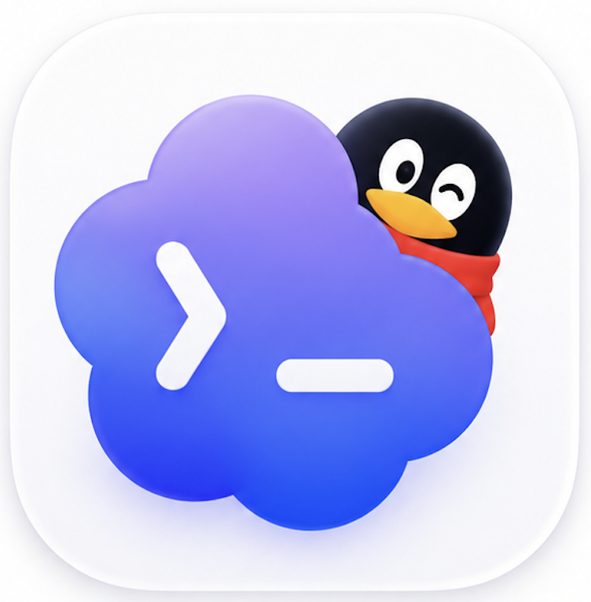
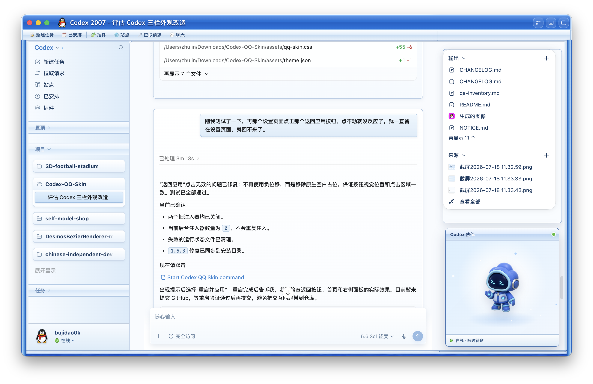
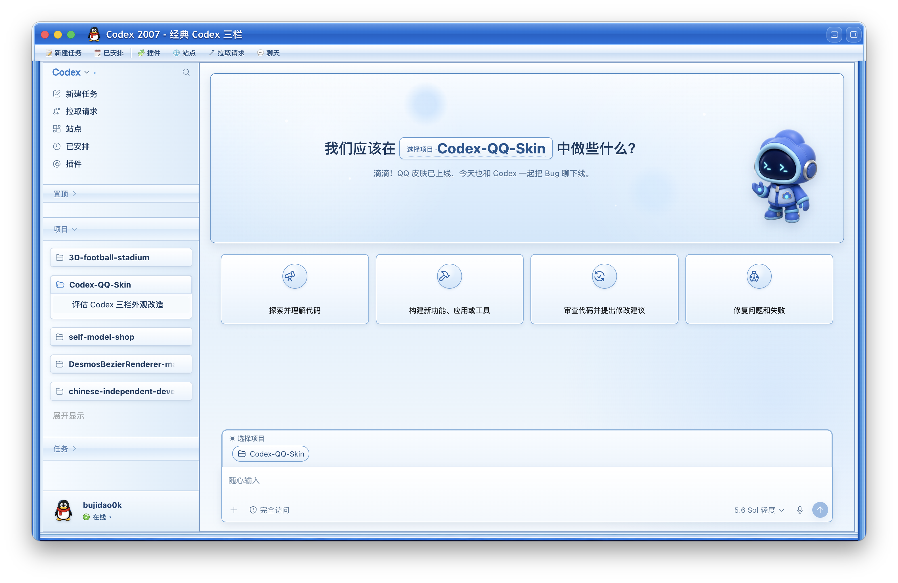

<p align="center">
  
</p>

# Codex QQ Skin

一套面向 Codex 桌面端的复古 QQ 风格外观。2.0 支持上传任意图片，在本机自动分析并生成完整皮肤方案；macOS 版为稳定版，Windows x64 版正在通过自动构建和实机验收进入预览阶段。

> 非 OpenAI、腾讯或 QQ 官方产品。本项目不会修改官方 `.app`、`app.asar`、代码签名、API Key 或 Base URL。

## 效果预览

### 任务详情



### 新建任务



## 安装

> Windows 用户请查看 [`README-WINDOWS.md`](./README-WINDOWS.md)。Windows 发布 ZIP 由 GitHub Actions 的 Windows Runner 构建，包含独立 Node.js 运行时。

安装前请确保官方 Codex/ChatGPT 桌面端至少成功启动过一次，并完全退出 Codex。项目不要求另行安装 Node.js。

### 安装方式 1：通过终端安装

1. 在 GitHub 项目页点击 **Code → Download ZIP**，下载后解压。
2. 打开“终端”，依次执行：

```bash
cd ~/Downloads/Codex-QQ-Skin
xattr -dr com.apple.quarantine .
chmod +x ./*.command scripts/*.sh
./scripts/install-qq-skin-macos.sh
```

如果项目不在 `~/Downloads/Codex-QQ-Skin`，请输入 `cd `（末尾保留空格），将解压后的项目文件夹拖进终端窗口，然后按回车，再执行后面三条命令。

`xattr` 命令用于移除 GitHub 下载文件的 macOS 隔离标记。请只对确认来自本项目官方仓库的文件执行该命令，不需要使用 `sudo`。

### 安装方式 2：使用 APP 一键安装（普通用户推荐）

1. 前往 [GitHub Releases](https://github.com/zhulin025/Codex-QQ-Skin/releases)，下载最新版本的 `Codex QQ Skin.app.zip`。
2. 解压后将 **Codex QQ Skin.app** 拖入“应用程序”文件夹。
3. 双击打开 APP，首次点击“一键安装并启动”。
4. 安装完成后，以后直接双击 APP 即可启动 QQ 皮肤版 Codex，不需要打开终端或手动修改文件权限。

由于当前 APP 未使用 Apple Developer ID 签名和公证，首次打开时可能出现“无法验证开发者”或“Apple 无法检查是否包含恶意软件”。请确认 APP 下载自本项目的官方 GitHub Release，然后按以下步骤放行：

1. 打开“系统设置”。
2. 进入“隐私与安全性”。
3. 向下滚动到“安全性”，会看到关于 `Codex QQ Skin.app` 的提示。
4. 点击“仍要打开”。
5. 输入 Mac 登录密码或使用 Touch ID。
6. 再次点击“打开”。

这个安全确认通常只需完成一次，之后可以像普通 APP 一样直接双击打开。不要关闭 macOS 的整体安全保护，也不需要使用终端执行 `chmod` 或 `xattr`。

### 安装方式 3：双击命令文件

1. 在 GitHub 项目页点击 **Code → Download ZIP**，下载后解压。
2. 完全退出 Codex。
3. 双击 `Install Codex QQ Skin.command`。
4. 等待安装完成，然后使用桌面上生成的 `Codex QQ Skin.command` 启动主题版 Codex。

如果 macOS 提示“Apple 无法验证”：

1. 先右键 `Install Codex QQ Skin.command`，选择“打开”，然后再次确认。
2. 如果仍被拦截，请打开“系统设置 → 隐私与安全性”，在安全提示处点击“仍要打开”并完成身份验证。
3. 如果系统没有显示“仍要打开”，请改用上面的“安装方式 1”，通过 `xattr` 命令移除隔离标记后安装。

运行引擎会安装到 `~/.codex/codex-qq-skin-studio`，主题和运行状态保存在 `~/Library/Application Support/CodexQQSkin`。

## 效果特点

### 2.0 三模式皮肤

- `原生`：完整恢复 Codex 官方界面与颜色。
- `QQ`：使用固定的蓝银 QQ 2007 外框、左侧栏、三栏布局、右侧摘要托盘和 Codex 伙伴，不受用户图片配色影响。
- `自定义`：保留 Codex 原生界面结构，根据用户图片自动生成配色、焦点和新建任务页构图。
- 三种模式可在右上角即时切换。每次切换都会完整重建目标模式的布局、颜色和装饰，不会遗留上一套皮肤的侧栏颜色或面板状态。
- 人物及普通照片会在新建任务顶部构建框中优先完整显示，避免为了铺满横幅而截断头部或身体；真正的超宽背景图仍保持铺满效果。

- 38px 深蓝标题行与 29px 蓝银工具行组成一体化复古标题区。
- 左上企鹅与动态任务标题避开 macOS 交通灯，不随窗口宽度拉伸。
- 右上三颗控件直接复用 Codex 原生按钮的 SVG、尺寸与点击行为，不再绘制多余的关闭按钮。
- 自动打开 Codex 原生左侧栏与固定摘要，形成左侧项目、中间对话、右侧摘要的三栏布局。
- 右上保留真实“输出 / 来源 / 进度 / 子代理”，右下 Codex 伙伴提供打开宠物、终端、提示音三个快捷按钮，并显示任务状态与本周剩余用量。
- 左下显示 QQ 风格企鹅头像、当前用户名和绿色在线状态。
- Codex 完成任务时播放“咳嗽”提示音，需要授权时播放另一组急促“滴滴”声；伙伴卡可一键静音。
- 项目、任务、每轮对话、代码块与输入框使用蓝银旧式面板样式。
- 设置页保持原生双栏结构，进入设置时自动收起任务伙伴卡。
- 一键验证、一键暂停和一键恢复官方外观。

## macOS 系统要求

- macOS（Apple Silicon 或 Intel）。
- 已安装官方 Codex/ChatGPT 桌面端，并至少正常启动过一次。
- 建议窗口宽度不小于 `1180px`，三栏模式才能完整显示。
- 安装前退出 Codex，避免应用正在保存配置。

项目不要求单独安装 Node.js。运行时会验证并使用官方 Codex 应用内签名的 Node.js。

## 日常使用

安装后可以使用仓库入口：

- `Start Codex QQ Skin.command`：启动复古主题。
- `Customize Codex QQ Skin.command`：导入自己的背景图。
- `Verify Codex QQ Skin.command`：检查签名、运行时、注入结果并截图。
- `Restore Codex QQ Skin.command`：停止主题并恢复官方外观。
- `Install Menu Bar.command`：安装可选的 SwiftBar 菜单栏入口。

终端对应命令：

```bash
./scripts/start-qq-skin-macos.sh
./scripts/doctor-macos.sh --require-live
./scripts/pause-qq-skin-macos.sh
./scripts/restore-qq-skin-macos.sh --restore-base-theme --restart-codex
```

## 更换背景图

最简单的方式是打开 `Codex QQ Skin.app`，点击“上传图片，生成我的皮肤…”。选择图片后，2.0 会在本机自动完成主色、明暗、视觉焦点、安全留白、背景构图与任务页模式分析，并立即切换到生成的“自定义”皮肤。图片不会上传到网络。

右上角提供三个独立选项：

- `原生`：完整恢复 Codex 官方界面。
- `QQ`：固定的稳定版 QQ 复古皮肤，始终使用内置素材和布局。
- `自定义`：在 Codex 原生界面结构上应用用户图片；人物与普通照片在新建任务页优先完整显示，超宽画面按照视觉焦点和安全区铺满；只有成功导入图片后才可选择。

自定义图片不会覆盖 QQ 皮肤。三种模式可以随时切换，最近一次选择会保存在本机。

```bash
./scripts/load-image-theme-macos.sh --file /绝对路径/你的图片.png \
  --appearance light \
  --safe-area center \
  --task-mode off
```

重新执行启动脚本即可应用。QQ 标题栏、三栏布局和伙伴卡不会被替换。

## 任务提示音

提示音默认开启，音量约为 48%。完成提示音使用耳聆网页面标注为 CC0 的“QQ系统消息提示音”，其他提示音由 Web Audio 在本地实时合成：

- 任务从“运行中”切换到完成：播放两段短促“咳咳”声。
- 新出现命令或操作授权卡片：播放四段急促“滴滴”声，同一张授权卡片只提醒一次。
- 首次打开皮肤并与窗口交互，或网络从离线恢复在线：播放两段“敲门”声。
- 手动点击停止任务、切换任务、热更新皮肤不会误报完成。
- 在右侧「Codex 伙伴」卡片点击「🔊 提示音」可静音，设置会保存在本机；同一排还可打开 Codex 原生宠物和切换终端面板。
- 伙伴卡右下读取 Codex 原生周用量，显示“本周剩余 XX%”；原生用量提示暂时消失时保留最近一次真实读数，从未读取到数据时显示“--”。

自定义主题也可以在 `theme.json` 中调整：

```json
"sound": {
  "enabled": true,
  "volume": 0.48,
  "completed": "cough",
  "approval": "alert",
  "online": "knock"
}
```

`completed` 还可设为 `didi`，`approval` 和 `online` 也可设为 `didi`，`volume` 范围为 `0..1`。首次使用时需要先在 Codex 窗口内点击或按键一次，以满足 Chromium 的音频播放规则。

咳嗽声的来源、页面许可声明和文件校验值见 [`assets/audio/qq-system-cough.LICENSE.md`](assets/audio/qq-system-cough.LICENSE.md)。

## 验证与开发

```bash
npm test
./scripts/doctor-macos.sh
npm run build:app
```

`npm run build:app` 会在 `release/` 生成同时支持 Apple Silicon 与 Intel 的 `Codex QQ Skin.app`。2.0 Release 同时提供 `Codex QQ Skin.app.zip` 和 Windows x64 便携 ZIP；请只从本仓库的 [GitHub Releases](https://github.com/zhulin025/Codex-QQ-Skin/releases) 下载。设置 `DEVELOPER_ID_APPLICATION` 环境变量后会使用对应证书签名；公开分发前还需使用 Apple 公证服务处理最终 ZIP/DMG。

测试覆盖注入 payload、图片元数据、主题切换、UTF-8 配置往返、回环 CDP 限制、清理恢复和官方签名检查。

## 目录结构

```text
assets/      外框、企鹅、CSS 与 renderer 注入代码
presets/     经典 Codex QQ 三栏预设
scripts/     安装、启动、验证、换图、暂停和恢复脚本
menubar/     可选 SwiftBar 菜单插件
tests/       macOS 自动化回归测试
```

仓库保留 macOS 稳定版和 Windows x64 预览版共享的皮肤代码；两套系统分别使用 Shell/Swift 和 PowerShell 运行层。

## 工作原理与安全边界

Codex QQ Skin 通过仅监听 `127.0.0.1` 的 Chromium DevTools Protocol，把 CSS、透明外框和少量非交互装饰注入 Codex renderer。侧栏、对话、输入框、输出和来源依然是 Codex 原生 DOM。

- 不写入官方安装目录。
- 不修改 `app.asar` 和应用签名。
- WebSocket 只接受经过校验的 loopback Codex 页面端点。
- 调试端口开启期间，不要运行来源不明的本机程序。
- 恢复脚本会停止 watcher、移除注入并恢复保存的外观配置。

## 来源说明

本项目使用并改造了 [Codex Dream Skin](https://github.com/Fei-Away/Codex-Dream-Skin) macOS 源码，包括回环 CDP 启动器、renderer 注入器、主题配置保护、签名验证和恢复流程。

在此基础上，本仓库重新实现了 QQ 复古双层标题栏、三栏自动布局、原生摘要对齐、Codex 伙伴卡、QQ 在线用户卡、响应式窗框和相应测试。

## 商标与素材声明

- Codex、ChatGPT 与 OpenAI 名称及相关权利属于其权利人。
- QQ 与腾讯名称及相关权利属于其权利人。
- 本仓库企鹅为 AI 生成的非官方复古风格素材，不代表腾讯或 QQ 官方图标授权。
- `codex-pet.png` 与复古外框仅作为本项目的界面装饰素材。
- 商业分发前请自行完成商标、素材和当地法律审查。

## License

[MIT License](./LICENSE)
